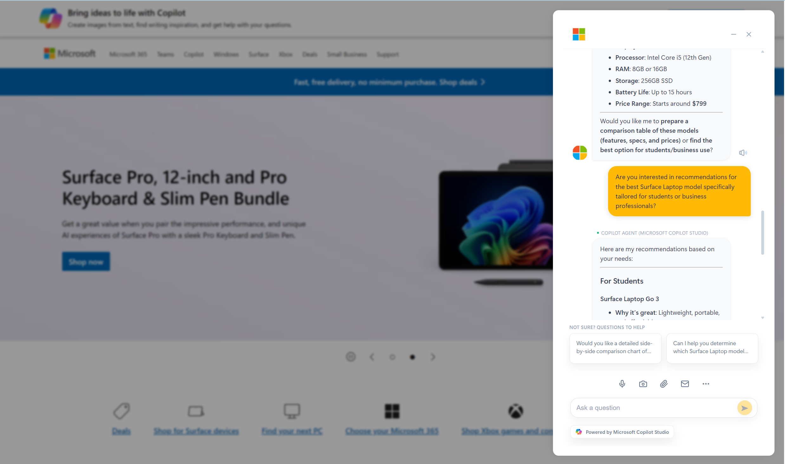

# D365 Contact Center Chat SDK - Live Chat Widget

A modern, customizable chat widget built with React and TypeScript that integrates with **Microsoft Dynamics 365 Contact Center** (Omnichannel for Customer Service) using the official Chat SDK.


## 🎯 Overview

This widget provides a fully-featured, embeddable chat experience that connects to your Dynamics 365 Contact Center environment. 

### How It Works: Chat Channel + Workstream

This widget requires two configurations in **Dynamics 365 Contact Center**:

#### 1️⃣ Chat Channel (Widget Configuration)
First, create a **Chat Widget** in D365 Admin Center. This gives you the three values needed to connect:
- `orgId` — Your organization ID
- `orgUrl` — Your Omnichannel URL  
- `widgetId` — The unique widget identifier

> **📖 Setup Guide:** [Add a chat widget](https://learn.microsoft.com/en-us/dynamics365/customer-service/administer/add-chat-widget)

#### 2️⃣ Workstream (Routing & Bot Configuration)
The **workstream** controls how conversations are routed — to bots, humans, or both:

| Workstream Configuration | What Happens |
|--------------------------|--------------|
| **Copilot Studio bot only** | Users chat with the bot — no human escalation |
| **Human agents only** | Users connect directly to live agents (with queue) |
| **Bot + Human escalation** | Bot handles initial conversation, escalates to human when needed |

> **📖 Learn more:** [Create and manage workstreams](https://learn.microsoft.com/en-us/dynamics365/customer-service/administer/create-workstreams)

**This means you can use this widget for:**
- ✅ A standalone **Copilot Studio agent/bot** (self-service, no humans)
- ✅ A **human-only** support channel (traditional live chat)
- ✅ A **hybrid** experience (bot first, escalate to human when needed)

The widget automatically adapts — it will show queue position/wait times when connecting to human agents, and seamlessly handle the handoff from bot to human if configured.

### 📸 Preview

<p align="center">
  
</p>

<p align="center"><em>The widget supports full branding customization — configure your logo and brand colors in code for production deployments.</em></p>

---

## 🏗️ Architecture: Two-Layer Design

> **Important**: This project has **two distinct layers** designed for different audiences. Please read this section carefully to understand which parts apply to you.

<p align="center">
  
  
</p>

### 🟢 Layer 1: Core Chat Widget (For Customers & Production)

**This is what you need if you're deploying to end users.**

The core layer connects directly to Microsoft Dynamics 365 Contact Center using the official Omnichannel Chat SDK. It provides:

| Feature | Description |
|---------|-------------|
| ✅ Real-time chat | Connect with Copilot Studio bots and live agents |
| ✅ File attachments | Send/receive images and documents |
| ✅ Adaptive Cards | Rich interactive content from your bot |
| ✅ Typing indicators | See when agents are responding |
| ✅ Queue management | Display wait times and position |
| ✅ Email transcript | Send conversation history to customers |
| ✅ Voice input | Speech-to-text messaging |
| ✅ Text-to-speech | Read responses aloud for accessibility |

**⚠️ Important: Configuration Security**

> **For Production:** Never pass `orgId`, `orgUrl`, or `widgetId` as URL parameters! These should be securely configured in your codebase or environment variables.

**The URL parameter approach (`?orgId=xxx&orgUrl=xxx`) is ONLY for:**
- Local development and testing
- Quick demos
- Partner/Microsoft internal showcases

**For Production Deployment, see [Secure Configuration Guide](#-secure-configuration-for-production) below.**

---

### 🔵 Layer 2: Dynamic Branding & Demo Capabilities (For Microsoft & Partners)

**This is designed for internal demos, partner showcases, and rapid prototyping.**

We built an additional layer on top of the core widget specifically to help **Microsoft teams, partners, and sales engineers** demonstrate the product quickly without needing to configure a full D365 environment for each customer demo.

| Feature | Purpose |
|---------|---------|
| 🎨 Dynamic logo extraction | Pass `?company=contoso.com` and we fetch their logo automatically |
| 🌈 Automatic color theming | Colors are extracted from the logo to brand the entire UI |
| 🎯 URL parameter overrides | Customize colors via `?primaryColor=#0078D4` |
| 🧩 Chrome Extension | Inject the widget onto ANY website for live demos |
| 📱 PWA icons | Dynamic app icons for "Add to Home Screen" demos |
| 🤖 AI follow-up questions | Demo feature showing AI-powered suggestions |
| 🔗 Copy URL & Share | Copy chat URL to test on mobile devices or share with others |
| 📲 Add to Home Screen | PWA support lets testers add the widget as a mobile app icon |

**How Layer 2 works:**

```
https://your-hosted-widget.com/?orgId=xxx&orgUrl=xxx&widgetId=xxx&company=microsoft.com
                                                                    ↑
                                                    This triggers Layer 2 magic:
                                                    • Fetches Microsoft's logo
                                                    • Extracts brand colors
                                                    • Themes the entire widget
```

**The Chrome Extension** allows you to:
1. Visit any customer's website
2. Click the extension icon
3. The chat widget appears on their site with their branding
4. Perfect for "imagine this on your website" demos

**Copy URL Feature (Demo/Testing Only):**

The widget includes a "Copy chat link" button in the menu panel that:
1. Copies the full URL with all configuration parameters
2. Allows you to open on a **mobile device** for testing responsive design
3. Enables **"Add to Home Screen"** on mobile — the widget appears as a native app with dynamic branding
4. Perfect for sharing demo links with colleagues or stakeholders

> ⚠️ **Security Warning:** The copied URL contains your `orgId`, `orgUrl`, and `widgetId`. Only share with trusted parties and NEVER use URL parameters in production.

---

### 📋 Quick Reference: Which Layer Do I Need?

| I am a... | I want to... | Use |
|-----------|--------------|-----|
| **Customer** | Deploy chat widget to my users | **Layer 1 only** — Configure branding in code (see below) |
| **Customer** | Quickly test the widget | **Layer 1** — Use required params only |
| **Microsoft/Partner** | Demo to a prospect | **Layer 2** — Use `?company=` for instant branding |
| **Microsoft/Partner** | Show widget on customer's website | **Layer 2 + Chrome Extension** |
| **Developer** | Customize and extend | Fork repo, modify as needed |

---

### ⚠️ Important Notes

**For Production Deployments (Customers):**
- ✅ Use Layer 1 features only
- ✅ Configure branding directly in the code (logo URL, colors) — see [Branding Configuration](#-branding-configuration-for-production) below
- ✅ Host on a secure domain (HTTPS required)
- ✅ Add your domain to D365 allowed origins
- ❌ Don't rely on dynamic logo extraction in production (it uses a third-party API)
- ❌ Don't use the demo AI follow-up questions feature

> **⚠️ Note on Branding:** This widget does NOT pull branding (logo, colors) from Omnichannel admin settings. You must configure branding directly in the code or via environment variables.

**For Demos (Microsoft/Partners):**
- ✅ Use Layer 2 features freely
- ✅ Use Chrome Extension for impressive live demos
- ✅ Use `?company=` parameter for instant branding
- ⚠️ Remember: Demo features may have external API dependencies

---

## 🚀 Production Deployment Guide

### � Secure Configuration for Production

> **Enterprise Best Practice:** Sensitive configuration values like `orgId`, `orgUrl`, and `widgetId` should NEVER be exposed in URLs or client-side code that can be easily inspected.

**There are 3 recommended approaches for production:**

---

#### Option 1: Environment Variables at Build Time (Recommended)

**Step 1:** Create a `.env.production` file (DO NOT commit this to git):

```env
VITE_ORG_ID=your-organization-id-here
VITE_ORG_URL=https://your-org.crm.dynamics.com
VITE_WIDGET_ID=your-widget-id-here
VITE_COMPANY=yourcompany.com
```

**Step 2:** Modify `src/config.ts` to use environment variables:

```typescript
// src/config.ts - PRODUCTION CONFIGURATION

export const getOmnichannelConfig = () => {
  // For PRODUCTION: Use environment variables (set at build time)
  // These get baked into the bundle during 'npm run build'
  const orgId = import.meta.env.VITE_ORG_ID;
  const orgUrl = import.meta.env.VITE_ORG_URL;
  const widgetId = import.meta.env.VITE_WIDGET_ID;
  const company = import.meta.env.VITE_COMPANY;

  // Fallback to URL params ONLY for development/demo
  const params = new URLSearchParams(window.location.search);
  
  return {
    orgId: orgId || params.get("orgId"),
    orgUrl: orgUrl || params.get("orgUrl"),
    widgetId: widgetId || params.get("widgetId"),
    company: company || params.get("company"),
    // ... rest of config
    isValid: !!(orgId || params.get("orgId")) && 
             !!(orgUrl || params.get("orgUrl")) && 
             !!(widgetId || params.get("widgetId"))
  };
};
```

**Step 3:** Add `.env.production` to `.gitignore`:

```gitignore
# Environment files with secrets
.env.production
.env.local
.env.*.local
```

**Step 4:** Build for production:

```bash
npm run build
```

The values are embedded at build time — no URL parameters needed!

---

### 🎨 Branding Configuration for Production

> **Important:** This widget does NOT fetch branding from Dynamics 365 Omnichannel admin settings. Logo and colors must be configured directly in the code.

#### Setting Your Logo

**Option A: Host your own logo file**

1. Add your logo to the `src/assets/` folder (e.g., `src/assets/company-logo.png`)
2. Modify `src/App.tsx` to use your logo:

```typescript
// At the top of App.tsx, change the import:
import aiIcon from "./assets/company-logo.png";  // Your logo

// Remove or comment out the dynamic logo loading useEffect
// The widget will use your imported logo directly
```

**Option B: Use a hosted logo URL**

```typescript
// In src/App.tsx, set your logo URL directly:
const [logoUrl, setLogoUrl] = useState<string>("https://your-cdn.com/logo.png");
```

#### Setting Your Brand Colors

**Option A: Add to the brandColors map in `src/config.ts`:**

```typescript
const brandColors: Record<string, { primary: string; secondary: string; light: string; dark: string }> = {
  // Add your company
  "yourcompany.com": { 
    primary: "#0078D4",    // Main brand color (buttons, links, user messages)
    secondary: "#005A9E",  // Secondary accent color
    light: "#DEECF9",      // Light backgrounds, hover states
    dark: "#004578"        // Dark accents, text
  },
};
```

Then set `company=yourcompany.com` in your config.

**Option B: Use environment variables:**

```env
# .env.production
VITE_PRIMARY_COLOR=#0078D4
VITE_SECONDARY_COLOR=#005A9E
VITE_LIGHT_COLOR=#DEECF9
VITE_DARK_COLOR=#004578
```

**Option C: Hardcode in `src/config.ts`:**

```typescript
// Return fixed colors instead of extracting from logo
customColors: {
  primary: "#0078D4",
  secondary: "#005A9E", 
  light: "#DEECF9",
  dark: "#004578"
},
```

#### Color Usage Guide

| Color | Where It's Used |
|-------|-----------------|
| `primary` | User message bubbles, buttons, links, active states |
| `secondary` | Secondary buttons, borders |
| `light` | Hover backgrounds, light accents |
| `dark` | Dark mode accents, emphasis text |

#### Remove Dynamic Branding for Production

To fully disable Layer 2 dynamic branding features:

```typescript
// In src/App.tsx, remove or comment out:

// 1. Remove the logo loading useEffect that calls getCompanyLogoUrl()
// 2. Remove the color extraction useEffect that calls extractColorsFromImage()
// 3. Set your logo and colors directly as shown above
```

---

#### Option 2: Hardcode Configuration (Simple but Less Flexible)

For organizations with a single deployment, directly modify `src/config.ts`:

```typescript
// src/config.ts - HARDCODED PRODUCTION CONFIG

export const getOmnichannelConfig = () => {
  // ⚠️ PRODUCTION CONFIGURATION - DO NOT USE URL PARAMETERS
  return {
    orgId: "xxxxxxxx-xxxx-xxxx-xxxx-xxxxxxxxxxxx",
    orgUrl: "https://your-org.crm.dynamics.com",
    widgetId: "xxxxxxxx-xxxx-xxxx-xxxx-xxxxxxxxxxxx",
    channelId: "lcw",
    company: "yourcompany.com",
    
    // Branding - set your colors directly
    customColors: {
      primary: "#0078D4",
      secondary: "#005A9E",
      light: "#DEECF9",
      dark: "#004578"
    },
    
    // Disable demo features
    pauUrl: null,      // Disable AI follow-up questions
    agentsUrl: null,   // Disable dynamic agents
    
    isValid: true
  };
};
```

---

#### Option 3: Server-Side Configuration API (Most Secure)

For maximum security, fetch configuration from your own backend:

```typescript
// src/config.ts - FETCH FROM SECURE BACKEND

let cachedConfig: OmnichannelConfig | null = null;

export const getOmnichannelConfig = async () => {
  if (cachedConfig) return cachedConfig;
  
  try {
    // Your backend validates the request and returns config
    const response = await fetch('/api/chat-config', {
      credentials: 'include', // Include auth cookies
      headers: {
        'Content-Type': 'application/json'
      }
    });
    
    if (!response.ok) throw new Error('Config fetch failed');
    
    cachedConfig = await response.json();
    return cachedConfig;
  } catch (error) {
    console.error('Failed to load chat configuration');
    return { isValid: false };
  }
};
```

Your backend (`/api/chat-config`) would:
- Authenticate the request
- Return configuration only to authorized users
- Keep secrets server-side

---

#### Configuration Approach Comparison

| Approach | Security | Flexibility | Complexity | Best For |
|----------|----------|-------------|------------|----------|
| **Environment Variables** | 🟢 High | 🟢 High | 🟡 Medium | Most production deployments |
| **Hardcoded** | 🟡 Medium | 🔴 Low | 🟢 Low | Single-tenant, simple deployments |
| **Server-Side API** | 🟢 Highest | 🟢 Highest | 🔴 High | Enterprise, multi-tenant |
| **URL Parameters** | 🔴 Low | 🟢 High | 🟢 Low | Development & demos ONLY |

---

### �🔐 Security Checklist

Before deploying to production, ensure you complete these critical steps:

| Item | Action | Priority |
|------|--------|----------|
| **HTTPS** | Host on HTTPS only — Omnichannel SDK requires secure connections | 🔴 Critical |
| **CORS Origins** | Add your domain to D365 Admin → Channels → Chat → Allowed Origins | 🔴 Critical |
| **Content Security Policy** | Configure CSP headers to allow D365 domains | 🟡 High |
| **Authentication** | Consider adding pre-chat authentication if needed | 🟡 High |
| **Data Residency** | Verify data flows comply with your region's requirements | 🟡 High |
| **Remove Demo Code** | Remove or disable Layer 2 demo features (see below) | 🟡 High |

### 🧹 Code Cleanup for Production

**If you're deploying for customers, we recommend removing/disabling these demo features:**

#### 1. Remove Dynamic Logo Extraction
In `src/config.ts`, the `getCompanyLogoUrl()` function uses a third-party API (`logo.dev`). For production:

```typescript
// BEFORE (Demo mode):
return `https://img.logo.dev/${baseUrl}?token=...`;

// AFTER (Production): Use your own hosted logo
return "/assets/your-company-logo.png";
```

#### 2. Remove AI Follow-up Questions
In `src/App.tsx`, find and remove or disable the `fetchFollowUpQuestions()` function and related state:

```typescript
// Comment out or remove these lines:
// const [suggestions, setSuggestions] = useState<Suggestion[]>([]);
// const [suggestionsLoading, setSuggestionsLoading] = useState(false);
// const fetchFollowUpQuestions = async (botResponses: string) => { ... }
```

Also remove the suggestions UI section in the JSX.

#### 3. Remove Color Extraction
In `src/colorExtractor.ts`, this file is only needed for demo purposes. For production:
- Set your brand colors directly in `src/config.ts` 
- Or use URL parameters: `?primaryColor=#0078D4`

#### 4. Hardcode Your Branding
In `src/config.ts`, add your company to the `brandColors` map:

```typescript
const brandColors: Record<string, {...}> = {
  "yourcompany.com": { 
    primary: "#0078D4", 
    secondary: "#005A9E", 
    light: "#DEECF9", 
    dark: "#004578" 
  },
};
```

#### 5. Remove Browser Extension (Optional)
The `/browser-extension` folder is only for demo purposes. You can:
- Delete the entire folder for production builds
- Or simply don't distribute it to customers

### ⚡ Performance Considerations

| Area | Recommendation |
|------|----------------|
| **Bundle Size** | Run `npm run build` — Vite tree-shakes unused code |
| **Lazy Loading** | Consider lazy-loading the chat widget on user interaction |
| **CDN** | Host static assets on a CDN (Azure CDN, CloudFront) |
| **Caching** | Set appropriate cache headers for static assets |
| **Images** | Optimize logo/icon images before deployment |
| **Connection** | The SDK maintains a persistent WebSocket — monitor for reconnection handling |

### 🧪 Testing Recommendations

**Before going live, test these scenarios:**

| Test Case | What to Verify |
|-----------|----------------|
| **Happy Path** | User can start chat, send messages, receive responses |
| **Bot Handoff** | Escalation from Copilot to human agent works |
| **File Upload** | Images and PDFs upload successfully (test 5MB limit) |
| **Network Loss** | Widget handles offline/online transitions gracefully |
| **Mobile** | Test on iOS Safari, Android Chrome — responsive layout |
| **Accessibility** | Screen reader compatibility, keyboard navigation |
| **Load Testing** | Simulate concurrent users if high traffic expected |
| **Session Timeout** | Verify behavior when D365 session expires |
| **Browser Support** | Test on Chrome, Edge, Firefox, Safari |

### 📊 Monitoring & Logging

Consider adding:

```typescript
// Example: Add application insights or your preferred monitoring
import { ApplicationInsights } from '@microsoft/applicationinsights-web';

const appInsights = new ApplicationInsights({
  config: {
    connectionString: 'YOUR_CONNECTION_STRING'
  }
});
appInsights.loadAppInsights();
appInsights.trackPageView();
```

**Key metrics to monitor:**
- Chat session start/end rates
- Message send failures
- File upload failures
- Connection errors
- Average session duration

### 🌐 Browser Compatibility

| Browser | Version | Status |
|---------|---------|--------|
| Chrome | 90+ | ✅ Fully Supported |
| Edge | 90+ | ✅ Fully Supported |
| Firefox | 88+ | ✅ Fully Supported |
| Safari | 14+ | ✅ Supported (some speech features limited) |
| Mobile Chrome | Latest | ✅ Fully Supported |
| Mobile Safari | iOS 14+ | ✅ Supported |
| IE 11 | - | ❌ Not Supported |

### 📋 Pre-Launch Checklist

```
□ HTTPS configured and working
□ Domain added to D365 allowed origins
□ Demo features removed/disabled
□ Branding configured (logo, colors)
□ Tested on all target browsers
□ Tested on mobile devices
□ Error monitoring configured
□ Load tested (if applicable)
□ Accessibility audit completed
□ Security review completed
□ Backup/rollback plan documented
```

---

### ✨ Dynamic Branding (Layer 2 Details)

The widget features **intelligent automatic branding**:
- 🎨 **Auto Logo Detection** - Pass your company domain and the widget fetches your logo automatically
- 🌈 **Color Extraction** - Primary colors are extracted from your logo to theme the entire UI
- 🎯 **Custom Colors** - Override with your own brand colors via URL parameters
- 📱 **PWA Icons** - Dynamic app icons generated for "Add to Home Screen" functionality
- 🏷️ **Brand Name** - Document title and app name derived from your company

### Key Capabilities

- **Real-time chat** with bot and human agents via Omnichannel SDK
- **Adaptive Cards** rendering for rich interactive content
- **File attachments** - Upload images (JPG, PNG) and PDFs
- **Voice input** - Speech-to-text for hands-free messaging
- **Text-to-speech** - Read agent responses aloud
- **Email transcript** - Send conversation history to email
- **Dynamic branding** - Auto-extract colors from company logos
- **Queue management** - Display position and estimated wait time
- **Agent switching** - Switch between support topics *(UI only - routing not implemented)*
- **Suggested actions** - Quick reply buttons from bot responses
- **Follow-up questions** - AI-powered question suggestions *(demo feature)*
- **PWA support** - Add to Home Screen with dynamic icons
- **Chrome Extension** - Inject widget into any website

## 🚀 Quick Start

### Prerequisites

- Node.js 18+ 
- A Dynamics 365 Contact Center environment with:
  - Organization ID
  - Organization URL
  - Chat Widget ID (from Omnichannel admin)

### Installation

```bash
# Clone the repository
git clone https://github.com/KarthikMallaya/d365-contactcenter-chatsdk-lcw.git
cd d365-contactcenter-chatsdk-lcw

# Install dependencies
npm install

# Start development server
npm run dev
```

### Configuration

The widget is configured via URL parameters. Navigate to:

```
http://localhost:5173/?orgId=YOUR_ORG_ID&orgUrl=https://YOUR_ORG.crm.dynamics.com&widgetId=YOUR_WIDGET_ID
```

#### Required Parameters

| Parameter | Description |
|-----------|-------------|
| `orgId` | Your Dynamics 365 Organization ID |
| `orgUrl` | Your Dynamics 365 Organization URL (e.g., `https://contoso.crm.dynamics.com`) |
| `widgetId` | Chat Widget ID from Omnichannel admin center |

#### Optional Parameters

| Parameter | Description |
|-----------|-------------|
| `company` | Company domain for automatic logo and branding (e.g., `contoso.com`) |
| `primaryColor` | Custom primary brand color (hex, e.g., `#0078D4`) |
| `secondaryColor` | Custom secondary color |
| `lightColor` | Custom light accent color |
| `darkColor` | Custom dark accent color |
| `pauUrl` | Power Automate URL for AI follow-up question generation |
| `agentsUrl` | Power Automate URL for dynamic agent/topic list |
| `channelId` | Channel identifier (defaults to `lcw`) |

### Example URL

```
https://yourapp.com/?orgId=abc123-def456&orgUrl=https://contoso.crm.dynamics.com&widgetId=xyz789&company=contoso.com&primaryColor=%230078D4
```

## 🏗️ Project Structure

```
├── src/
│   ├── App.tsx              # Main chat widget component
│   ├── chatSdk.ts           # Omnichannel SDK wrapper
│   ├── config.ts            # Configuration & branding utilities
│   ├── colorExtractor.ts    # Dynamic color extraction from logos
│   ├── index.css            # Styles
│   ├── main.tsx             # React entry point
│   └── assets/              # Icons and images
├── browser-extension/       # Browser extension for embedding (demo)
│   ├── manifest.json
│   ├── content.js
│   ├── popup.html
│   └── icons/
├── docs/                    # Architecture documentation
│   ├── ARCHITECTURE.md
│   ├── ARCHITECTURE_OVERVIEW.md
│   └── PRODUCTIZED_WIDGET_GUIDE.md
├── dist/                    # Production build output
└── public/                  # Static assets
```

## ✨ Features

### 💬 Chat Experience

- **Markdown rendering** - Rich text formatting with code blocks, lists, links
- **Typing indicators** - See when agents are composing responses
- **Message timestamps** - Clear time display for each message
- **Auto-scroll** - Smooth scrolling to latest messages

### 📎 File Handling

- **Image uploads** - JPG, PNG up to 5MB with preview thumbnails
- **PDF uploads** - Document attachments up to 5MB
- **Camera capture** - Direct photo capture on mobile devices
- **Download support** - Receive and download files from agents

### 🎨 Dynamic Branding

The widget automatically adapts to your company's brand:

1. **Logo Detection** - Fetches company logo from domain
2. **Color Extraction** - Extracts primary colors from logo
3. **Theme Application** - Applies colors to UI elements
4. **Predefined Brands** - Built-in color schemes for major companies

```typescript
// Custom colors via URL
?primaryColor=%23FF5722&secondaryColor=%23E64A19
```

### 🎤 Voice Features

- **Speech-to-text** - Click microphone to dictate messages
- **Text-to-speech** - Click speaker icon to hear agent responses
- **Language support** - Uses browser's speech recognition

### 📧 Email Transcript

Users can request their conversation transcript via email:
- Click the email icon in the action toolbar
- Enter email address
- Transcript is sent via Omnichannel's email functionality

### 🔄 Agent Switching (UI Demo - Implementation Pending)

> ⚠️ **Partial Implementation**: The agent switching UI is fully functional, but the backend routing to different Omnichannel workstreams has **not been implemented yet**. Currently, switching agents only updates the UI state and shows a toast notification.

The widget displays a panel for switching between different support topics:
- General Support
- Technical Support
- Sales & Products
- Billing & Account
- Feedback & Suggestions
- Urgent Assistance

**What's Implemented:**
- ✅ Agent selection UI panel
- ✅ Dynamic agent list loading from Power Automate (`agentsUrl`)
- ✅ Visual state management and toast notifications

**What Needs Implementation:**
- ❌ Connecting to different Omnichannel workstreams (different `widgetId` values)
- ❌ Ending current chat session and starting new one with different widget
- ❌ Preserving context/transcript when switching

**Intended Behavior (for contributors):**

Each "agent" should map to a different **Chat Widget ID** in Dynamics 365 Omnichannel, routing users to different queues/workstreams:

```typescript
// Example: Agent to Widget mapping (not yet implemented)
const agentWidgetMapping = {
  "general": "widget-id-for-general-queue",
  "technical": "widget-id-for-tech-support-queue",
  "sales": "widget-id-for-sales-queue",
  "billing": "widget-id-for-billing-queue"
};

// When user switches agent, the app should:
// 1. End current chat session
// 2. Reinitialize SDK with new widgetId
// 3. Start new chat session with the appropriate queue
```

**Dynamic Agents via Power Automate:**

You can provide a custom agent list by passing an `agentsUrl` parameter:
```
?agentsUrl=https://your-flow.azure.com/api/agents
```

Expected response format:
```json
{
  "agents": [
    { "id": "support", "name": "Customer Support", "description": "General help", "icon": "" },
    { "id": "tech", "name": "Technical Team", "description": "Technical issues", "icon": "" }
  ]
}
```

### 🤖 AI-Powered Follow-Up Questions (Demo Feature)

> ⚠️ **Demo Feature**: The follow-up question generation is included as a demonstration. The default `pauUrl` points to a sample Power Automate flow that may not be available. **Contributors should implement their own endpoint.**

After each bot response, the widget can fetch AI-generated follow-up questions to help users continue the conversation. This feature calls an HTTP endpoint (typically a Power Automate flow or Azure Function) that returns suggested questions.

#### Expected JSON Response Format

Your endpoint should return JSON in one of these formats:

**Option 1: Array property (recommended)**
```json
{
  "questions": [
    { "item": "How do I reset my password?" },
    { "item": "What are your business hours?" }
  ]
}
```

**Option 2: Simple string array**
```json
{
  "suggestions": [
    "How do I reset my password?",
    "What are your business hours?"
  ]
}
```

The widget extracts the first array found in the response and displays up to 2 questions.

#### Request Payload

Your endpoint receives a POST request with:
```json
{
  "botResponse": "The last message from the bot/agent",
  "companyName": "contoso.com",
  "url": "contoso.com"
}
```

#### Configuration

Pass your endpoint URL via the `pauUrl` query parameter:
```
?pauUrl=https://your-function.azurewebsites.net/api/generate-questions
```

**Implementation Ideas:**
- Azure Function with Azure OpenAI
- Power Automate flow with AI Builder
- Custom API with any LLM provider

## 🌐 Hosting & Deployment

This chat widget is a **static web application** that must be hosted on a web server to function. It cannot run as a local file due to browser security restrictions and the need to communicate with Dynamics 365 APIs.

### Recommended Hosting Options

| Platform | Description | Best For |
|----------|-------------|----------|
| **Azure Static Web Apps** | Free tier available, global CDN, custom domains | Production deployments |
| **Azure App Service** | Full web app hosting with SSL | Enterprise deployments |
| **Azure Blob Storage** | Static website hosting, very low cost | Simple deployments |
| **GitHub Pages** | Free hosting for public repos | Demo/testing |
| **Vercel / Netlify** | Free tier, automatic deployments | Quick prototyping |

### Deployment Steps

1. **Build the production bundle:**
   ```bash
   npm run build
   ```

2. **Deploy the `dist/` folder** to your hosting platform

3. **Configure your domain** in Dynamics 365:
   - Go to **Customer Service admin center** → **Channels** → **Chat**
   - Add your hosted domain to the **Allowed origins** list

### Environment Considerations

- **HTTPS Required**: Omnichannel SDK requires secure connections
- **CORS**: Your hosting domain must be whitelisted in D365 admin center
- **Custom Domain**: Recommended for production use with SSL certificate

### Example: Azure Static Web Apps Deployment

```bash
# Install Azure SWA CLI
npm install -g @azure/static-web-apps-cli

# Build the app
npm run build

# Deploy to Azure
swa deploy ./dist --env production
```

## 🧩 Chrome Extension

The included Chrome extension allows injecting the chat widget into any website.

### Installation

1. Download or clone this repository
2. Open `chrome://extensions/` (or `edge://extensions/` for Edge)
3. Enable "Developer mode"
4. Click "Load unpacked"
5. Select the `browser-extension` folder
6. Configure your Omnichannel parameters in the extension popup

See [browser-extension/README.md](browser-extension/README.md) for detailed instructions.

## 🛠️ Development

### Build Commands

```bash
# Development server with hot reload
npm run dev

# Production build
npm run build

# Preview production build
npm run preview
```

### Technology Stack

- **React 18** - UI framework
- **TypeScript** - Type safety
- **Vite** - Build tool and dev server
- **@microsoft/omnichannel-chat-sdk** - Official D365 Chat SDK
- **Adaptive Cards** - Rich card rendering
- **Marked** - Markdown parsing
- **DOMPurify** - XSS sanitization

## 📚 Documentation

- [Architecture Overview](docs/ARCHITECTURE_OVERVIEW.md) - High-level system design
- [Detailed Architecture](docs/ARCHITECTURE.md) - Component deep-dive
- [Productization Guide](docs/PRODUCTIZED_WIDGET_GUIDE.md) - Deployment best practices

## 🔧 Finding Your Omnichannel Parameters

1. Go to **Dynamics 365 Customer Service admin center**
2. Navigate to **Channels** → **Chat**
3. Select your chat widget
4. Copy the **Organization ID**, **Organization URL**, and **Widget ID** from the widget script

## 🤝 Contributing

1. Fork the repository
2. Create a feature branch (`git checkout -b feature/amazing-feature`)
3. Commit your changes (`git commit -m 'Add amazing feature'`)
4. Push to the branch (`git push origin feature/amazing-feature`)
5. Open a Pull Request

## 📄 License

This project is licensed under the **MIT License** - see the [LICENSE](LICENSE) file for details.

### Disclaimer

> ⚠️ **This is a community project, NOT an official Microsoft product.**

- Provided "AS IS" without warranty of any kind
- Not endorsed by or affiliated with Microsoft Corporation
- Microsoft, Dynamics 365, Copilot Studio are trademarks of Microsoft Corporation
- Requires a valid Microsoft Dynamics 365 Contact Center license
- Use at your own risk in production environments

## 🔗 Related Resources

- [Microsoft Omnichannel Chat SDK](https://github.com/microsoft/omnichannel-chat-sdk)
- [Dynamics 365 Contact Center Documentation](https://learn.microsoft.com/en-us/dynamics365/contact-center/)
- [Adaptive Cards](https://adaptivecards.io/)
- [Copilot Studio](https://www.microsoft.com/en-us/microsoft-copilot/microsoft-copilot-studio)

---

**Built for Microsoft Dynamics 365 Contact Center** | Powered by Microsoft Copilot Studio
